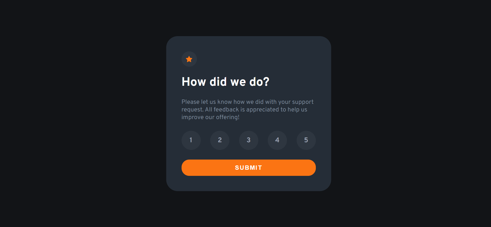

### Links

- Solution URL:
  [https://www.frontendmentor.io/challenges/interactive-rating-component-koxpeBUmI]

### The challenge

Users should be able to:

- View the optimal layout for the app depending on their device's screen size
- See hover states for all interactive elements on the page
- Select and submit a number rating
- See the "Thank you" card state after submitting a rating

### Screenshot

 

### Built with

- HTML
- SCSS
- TypeScript

# Frontend Mentor - Todo app solution

This is a solution to the
[Interactive rating component challenge on Frontend Mentor](https://www.frontendmentor.io/challenges/interactive-rating-component-koxpeBUmI).
